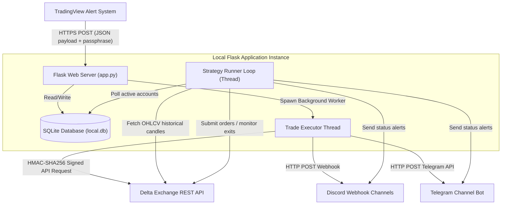
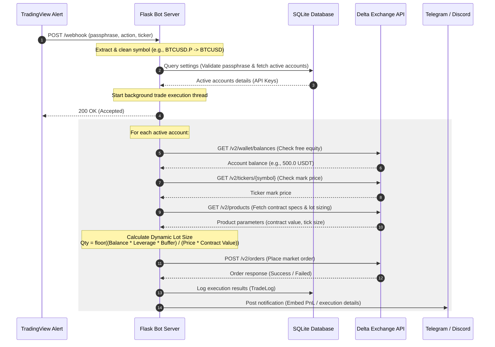
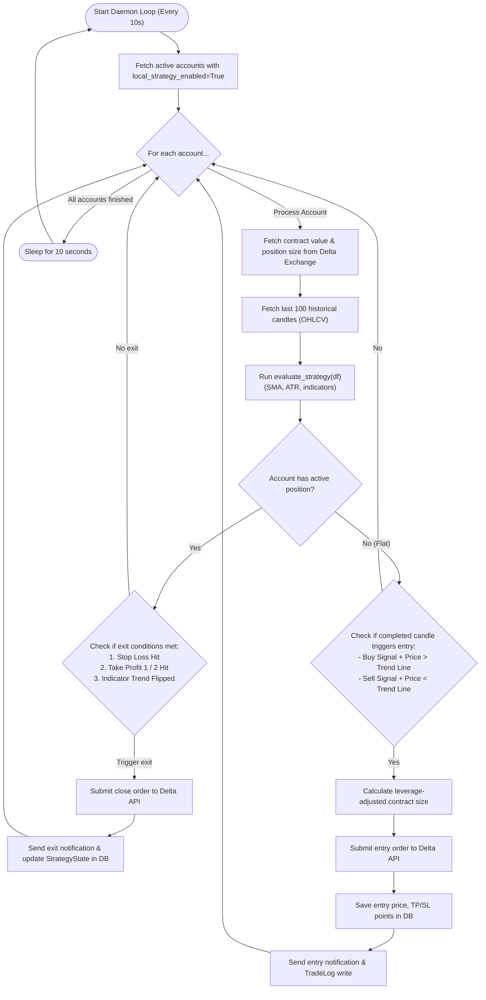
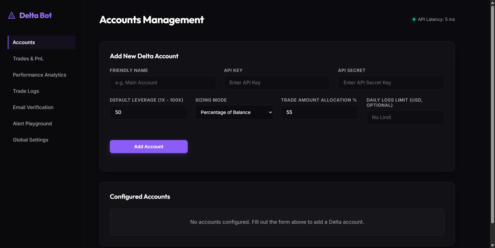
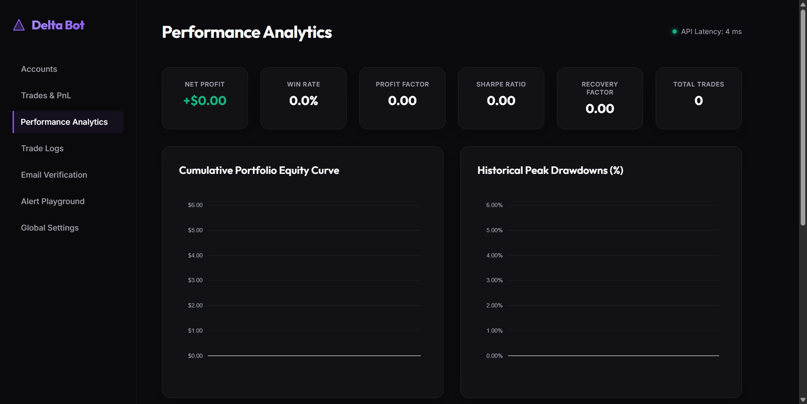

# Delta Exchange Webhook & Algorithmic Trading Bot

A professional, production-grade Python web service designed to bridge **TradingView Alerts** and **Delta Exchange** for 24/7 automated algorithmic trading. It handles incoming webhook alerts, validates credentials, manages multiple user accounts statefully in a database, calculates dynamic position sizes, handles trailing stop losses, and executes trades with low latency.

The system also includes a background strategy runner daemon that can fetch live candle data and run indicator logic locally.

---

## 🏗️ System Architecture & Design

The bot is structured into two concurrent components:
1. **The Webhook Listener (Flask API)**: An event-driven server that executes orders instantly upon receiving TradingView alert requests.
2. **The Local Strategy Runner (Background Daemon)**: A multi-threaded loop that polls live market data, computes indicators, monitors active positions, and executes rule-based exits/entries.

### 1. Overall System Dataflow



---

### 2. Webhook Execution Sequence

The sequence diagram below shows how an incoming TradingView signal (e.g., `buy`) is authenticated, processed, dynamically sized, and executed:



---

### 3. Background Strategy Daemon Flow

The strategy runner is a persistent background thread that runs a continuous loop to monitor indicators and manage position exits (e.g., stop loss, take profits) statefully:



---

## 📊 Dashboard Preview

The bot includes a premium, dark-mode web dashboard featuring live balance monitoring, performance analytics, and webhook testing tools.

### 1. Accounts & Risk Management
View configured accounts, live API connectivity statuses, current balances, and configure default leverages, sizing modes, and safety buffers.


### 2. Trades, PnL & Analytics
Review live trading performance, cumulative PnL graphs, key trading metrics (Win Rate, Profit Factor, Net PnL), and detailed trade execution logs.


---

## 🛠️ Environment Variables Configuration

Configure these environment variables in your server configuration (or a local `.env` file):

| Variable | Description | Default / Example |
| :--- | :--- | :--- |
| `DELTA_API_KEY` | Default Delta API Key (fallback if database is empty) | `your_delta_api_key` |
| `DELTA_API_SECRET` | Default Delta API Secret (fallback if database is empty) | `your_delta_api_secret` |
| `DELTA_BASE_URL` | Base API Endpoint (Global, India, or Testnet) | `https://api.delta.exchange` |
| `PASSPHRASE` | Custom secure passphrase to authenticate webhooks | `your_secure_trading_passphrase` |
| `DEFAULT_LEVERAGE` | Target leverage used to calculate dynamic sizing | `leverage` |
| `BALANCE_BUFFER_PCT` | Margin buffer percentage (e.g., 95 uses 95% equity, 5% fee cushion) | `balance%` |
| `TRADING_SYMBOL` | Target default symbol for local strategy runner | `symbol` |

---

## 🚀 Quick Start Guide

### 1. Installation
Clone the repository and install the dependencies:
```bash
pip install -r requirements.txt
```

### 2. Database Setup
The SQLite database file (`instance/local.db`) is automatically initialized with the correct database schema (accounts, settings, strategy states, and trade logs) on the first startup of the Flask app in [app.py](file:///E:/ETHUSD.P%20-%20Copy/app.py):
```python
from app import app, db
with app.app_context():
    db.create_all()
```

### 3. Run Locally
Start the local server:
```bash
python app.py
```
By default, the server runs on `http://127.0.0.1:5000` and displays a premium web dashboard for managing multiple accounts, toggling strategy states, viewing balances, and monitoring logs.

### 4. Running Tests
Run the unit test suite to verify everything functions:
```bash
python -m unittest verify_bot.py verify_strategy.py
```
*(References: [verify_bot.py](file:///E:/ETHUSD.P%20-%20Copy/verify_bot.py), [verify_strategy.py](file:///E:/ETHUSD.P%20-%20Copy/verify_strategy.py))*

---

## 📈 Custom Strategy Logic Integration

The bot includes placeholders to let you easily plug in your own custom trading indicators and entry/exit conditions:

1. **Indicator Formulas**: Open [strategy_logic.py](file:///E:/ETHUSD.P%20-%20Copy/strategy_logic.py) and modify the placeholder functions (e.g., `compute_chandelier_exit`, `compute_zlsma`, `track_liquidity_pools`).
2. **Signals & Rules**: Update `evaluate_strategy(df)` to specify how buy/sell conditions are triggered. Make sure it returns the exact same keys in the dictionary:
   ```python
   return {
       "long_stop": long_stop,      # Array of trailing stop-loss values
       "short_stop": short_stop,    # Array of trailing stop-loss values
       "dir": dir_arr,              # Trend direction array (1 = long, -1 = short)
       "buy_signal": buy_sig,       # Boolean entry signals
       "sell_signal": sell_sig,     # Boolean entry signals
       "zlsma": trend_line,         # Exit/trend filter line
       "bsl_created": bsl_created,  # Custom liquidity exits
       "ssl_created": ssl_created,  # Custom liquidity exits
       "long_condition": long_cond, # Final entry filters
       "short_condition": short_cond
   }
   ```
3. **Execution Settings**: Adjust risk values, leverage limits, and take-profit ratios (`TP1_RR`, `TP2_RR`) in [strategy_runner.py](file:///E:/ETHUSD.P%20-%20Copy/strategy_runner.py).
